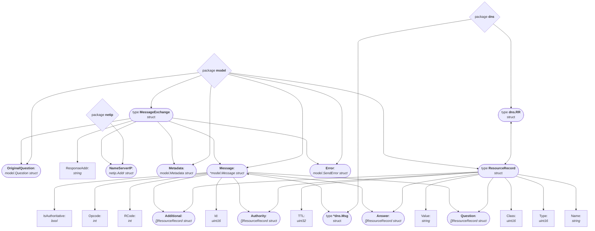

# Capstone Project: Utilizing YoDNS to Identify Dangling Records

## 1. Project Goal

This project uses **YoDNS**, a unique measurement toolchain, to study and identify the prevalence of DNS infrastructure issues, specifically:

- **Stale glue `A` and `AAAA` records**
- **Stale / dangling `CNAME` records**

Our goal is not just to measure final DNS answers for records such as `A`, `NS`, or `CNAME` records, since ordinary `dig` can already do that. However, typical resolvers utilize optimization strategies such as caching to reduce query load, and as such may not accurately capture the reality of DNS structure by not engaging in full DNS tree traversal [1]. Instead, we use YoDNS, designed by Steurer et al. [2025], to analyze DNS dependency structure and the query process at scale.

---

## 2. Project Pipeline

### Structural Overview:

Our methodology has three major stages:

1. **Data preprocessing**: Preparing an input database for efficient scanning by YoDNS
   - Start from the **Tranco Top 10K** list of domains.
   - Use **Subfinder** to discover subdomains from this list.
   - Filter and prepare candidate domains for later DNS analysis.

2. **YoDNS scanning**
   - Run a YoDNS scan on the prepared candidate set.
   - Store output efficiently.
   - Study the components of the output (in json format for visualization), namely its `Zonedata` and `Messages`.
  
3. **Dangling record extraction and analysis**
   - Extract glue-related information:
        - All NS response glue records containing IP addresses (`A`: `IPv4`, and `AAAA`: `IPv6`)
        - All authoritative `A` and `AAAA` records for those domains
   - Identify stale-glue candidates by comparing these records and quantify their prevalence/how frequently YoDNS encountered them.
   - Extract CNAME-related information and identify candidates for dangling CNAME records

---

## 3. Our Approach / What we Accomplished
_...and learning along the way_

### 3.1. We Built the Data Preprocessing Stage
_Task leader: Chenyun_

Before using YoDNS, we first worked on building a candidate dataset from the **Tranco Top 10K** to be used as an input `.csv` file for the scan.

**Our preprocessing pipeline is:**
   1. Take root domains from the Tranco 10K dataset
   2. Sample or iterate through selected root domains
   3. Use **Subfinder** to discover subdomains for each root domain
   4. Use DNS queries to filter discovered names
   5. Save usable candidates into output files for later YoDNS analysis

_The goal of this stage was to avoid running YoDNS blindly on arbitrary names and instead prepare a cleaner and more relevant set of domains and subdomains. Since stale DNS issues, such as dangling CNAMEs and other stale dependencies, are more likely to appear in deeper operational subdomains, relying solely on Tranco would likely cause us to miss many relevant cases._

---

### 3.2. We Implemented a Subdomain Collection with Subfinder
_Task leader: Chenyun_
Path= `data_preprocess/prepare_subfinder_data.pyNOERROR`

**We wrote preprocessing code to automate the following steps:**
   1. Read root domains from input CSV files
   2. Sample a subset of root domains when needed
   3. Run **Subfinder** on each root domain
   4. Collect discovered subdomains
   5. Test whether each discovered name has meaningful DNS results

We also designed the code to distinguish between:

- **Accepted candidates**: Domains with usable DNS results.
- **Excluded candidates**: Domains with unhelpful, empty, or invalid results.
   - Some of them are very interesting though, for example where a candidate's dns resolution status is `NOERROR` but  the returned result is `null`.

**About Subfinder:**
At the beginning of our subdomain collection process, we used CT logs, which contain public records of issued SSL/TLS certificates. However, we later realized that CT logs were not practical for our pipeline. The main limitation was their strict rate limits, which made it difficult to collect a large amount of data efficiently. Even though CT log services provide APIs that can be integrated into scalable scripts, the rate limits significantly slowed down our data collection process. Another issue was that the data from CT logs contained too much noise. Many certificates are wildcard certificates, such as *.example.com, and expanding them does not necessarily produce real, existing subdomains.

Therefore, we decided to use Subfinder instead. I first learned about this tool through Kali Linux. It is a useful subdomain discovery tool because it combines multiple data sources, including DNS brute-force enumeration, passive DNS, and intelligence platforms. We used Subfinder with its default configuration, without any API keys or additional service integrations. Subfinder was invoked via command line with the -silent and -d flags, relying solely on its built-in passive DNS enumeration sources that do not require authentication. 

This setup was sufficient for our goal because we did not need to collect a large number of subdomains from a single root domain. In fact, we wanted to avoid that situation. If too many candidate subdomains come from the same second-level domain, there may be a large amount of zone overlap in the final dataset(YoDNS result). This would reduce the diversity of the domains we analyze and make the results less representative. 

**important things we learned:**

   1. At first, We was concerned that subdomain collection might raise security concerns. However, we later learned that Subfinder, under its default configuration, primarily relies on passive subdomain enumeration. In other words, it does not actively probe the target domain by sending DNS queries directly to it. Instead, it gathers publicly available subdomain information from existing Internet sources. This made Subfinder more appropriate for our pipeline, because it allowed us to collect candidate subdomains while minimizing unnecessary traffic toward the target domains.

   2. The initial implementation was far too slow for our use case. Processing a dataset of approximately 3,000 domains took over 10 hours, which made iterating on the pipeline impractical.There were two main bottlenecks:
      - **Sequential DNS resolution**: The original code resolved each candidate domain one at a time. Each `dig` call involves a network round-trip that typically takes anywhere from 20ms to 500ms. With up to 10k domains, the total number of `dig` calls could reach into the hundreds of thousands, all waiting sequentially. Since `dig` is IO-bound, the CPU was sitting idle for the vast majority of the runtime.
      - **Per-row file writes**: The original code opened, wrote to, and closed the output CSV file for every single candidate row. Opening and closing a file thousands of times accumulates significant overhead over a long run.
   
   We addressed both issues in the optimized version. For DNS resolution, we introduced concurrent `dig` calls using Python's `ThreadPoolExecutor`, issuing up to 20 parallel requests per root domain. Since each thread spends most of its time waiting for a network response, running 20 at once costs roughly the same wall-clock time as running 1. For file writes, instead of writing after every row, we accumulate all accepted and excluded rows in memory and write them to disk in a single pass at the end, reducing thousands of file operations down to two.

---

### 3.3. We Learned How to Use YoDNS
_Task leader: Emma_

We carefully learned how to use the YoDNS measurement tool by analyzing its instructions, researching elements of its complex codebase, and doing lots of small-scale experiments:
   1. We began by reading all information provided in the [YoDNS GitHub repository](https://github.com/DNS-MSMT-INET/yodns) and descriptions of Struer et al. [2025]'s [published dataset](https://edmond.mpg.de/dataset.xhtml?persistentId=doi:10.17617/3.UBPZXP).
   2.  The GitHub repository, paper, along with other source materials on stale glue records and dangling CNAMEs were put into a NotebookLM notebook, which was used to help describe different functionalities of the codebase to help plan out small-scale experiments.
   3.  After installation of Go and YoDNS on two cs.colgate servers (Caspian and Malayan), an example makefile to run a simple resolution of one domain was identified and run, producing sample output in `.json` format.
   4.  We learned how to mimic the format of the makefile/write our own makefile to conduct configuration experiments on sample input DN lists and eventually the current largest `subfinder_candidates.csv` input list.
      - We created a capstone_test target to test variations of configuration changes to our modified `runconfig_capstone.json5` file (located in the `capstone-project/config/capstone_config` directory), which changed parameters of the example `runconfig.json5` file meant for large-scale scans (a copy is located in the `capstone-project/config/example_hardcore_config` directory) to match the description of parameters from the Steurer et al. [2025] paper, such as:
          -  Changing max `CNAM`E depth to 64
          -  Changing `MX`-followup to `true` to trace down `MX` records
          -  Ensuring all `NS` IPs are queried
          -  Changing input/output file directories
          -  Ensuring output files are in `.pb.zst` format to reduce space
   5.  Eventually, we created an efficient configuration for a large-scale scan that could be run using the makefile, and produced output in both `.pb.zst` and `.json` format using the `convertFormat` command to visually inspect the output format.     

---

### 3.4. Studied the Structure of YoDNS output
_Task leader: Emma_

We examined the `.json` output and identified the main components/objects containing the response:

- `Domains`: A list of the original target domains scanned
- `Zonedata`: the full DNS zone / nameserver dependency tree reconstructed by YoDNS
- `Messages`: the raw query-response log for the actual DNS lookups performed during the run, detailing all query, answer, and metadata information
   - _We also confirmed that `Messages` is not ordered like a simple human-readable recursive trace. Instead, it behaves more like a log of concurrent tasks, which explains why the message order may appear to jump between different zones and names._

---

### 3.5. Learned how to read `Messages`
_Task leader: Emma_

As the majority of information is contained in the `Messages` objects, including authoritative and glue records, we analyzed multiple examples and learned how to interpret its subsections:

- `OriginalQuestion`
- `NameServerIP`
- `ResponseAddr`
- `Metadata`
- `Message`
   - `RCode`
   - `IsAuthoritative`
   - `Question`
   - `Answer`
   - `Authority`
   - `Additional`
- `Error`
We identified that, in order to identify dangling records, we needed to get access to information within the `Message` itself:
- For example, to identify stale glue records, we wanted to find messages with `RCode`s of 1 (`A`) and 28 (`AAAA`) from authoritative name servers to compare all glue records for those domains to so that we may determine which are stale. However, how do we filter out all of the information less useful for our aims? Additionally, these `.json` files are HUGE; if we parsed the entirety of each output file via just looping in a python script, we wouldn't be able to scale our method up to a significantly larger number of input domains (10k or 1M). 

---

### 3.6. Extracted Relevant `Messages.Message` Components to Identify Stale Glue Records
_Task leader: Emma_
#### 3.6.a. Extracting messages and utilizing provided YoDNS code
As Steurer et al. [2025] scanned 812M domains over the course of 40 days, we positied that the large `yodns`codebase cloned from the GitHub repository would contain some built-in (efficient) methods for reading our binary output messages encoded using `protobuf` and filtering that output effectively. As such, we began to explore the provided yodns commands and their underlying code/data structures.

There are 20 commands listed on the `yodns/yodns --help` page, but most are very vaguely described, and, as they are written in Golang, they took significant research and experimentation to dissect. Commands of interest for our purposes included:
1. `scan`: We were already using it to conduct the YoDNS test scans
2. `convertFormat`: We had already used it to examine `.json` output format
3. `validate`: The sample makefile uses it, but its exact function was uncertain
4. `stats`: Seemed to provide some sort of statistics/metrics in regards to the scan's success
5. `bucketize`: Seemed to organize output files into zone "buckets" for file optimization and organization of future analysis
6. `mergeFiles`: Seemed to organize scan output files of various sizes to a standard size
7. `extractMessages` and `extractMessagesBinary`: These seemed like the most likely candidates for filtering for specfic record types, and as such were focused on.

**Commands we use:**
_We managed to run/ran these commands in our makefile_
1. `scan`
2. `convertFormat` (optional command we provide for viewable `.json` output files that are stored in a folder titled `YoDNS_output/Output_<#>_DN/json`)
3. `validate` _(optional command that allows us to check if YoDNS worked and see any errors that occured during resolution)_
4. `stats` _(optional command that allows us to see every target DN resolved in a specific output file, ending with a total number of DNs resolved, total messages and optional tagged DN counts)_
5. `extractMessages`: This command allowed us to filter YoDNS `json` output messages for specific `RCode` types and from only authoritative servers, which was our first step towards filtering the YoDNS output data for our specific goals.

_However, we did not feel like `extractMessages` was adequate, as large quantities of data we had no intention of using (Domain lists, Zonedata, and Message metadata) was still "clogging up" these large `.json` extracted output files. More importantly, there was no flag to specify only glue records; we could only extract every NS query message exchange. As a result, we looked into the underlying structure of the Go code for this command (located in `yodns/yodns/cmd/extractMessages.go` and a variety of other folders)..._

#### 3.6.b. Learn about the YoDNS struct system and using it to create our own modified message filtering command
Through tracing the `extractMessages.go` and `filters.go` files, we realized that numerous packages referencing files in other subfolders/directories, largely within the `yodns/resolver` directory, were imported and outline a complex system of structs that creates a somewhat object-oriented representation of the YoDNS scan components. The most important structs we identified for our purpose of filtering messages are mapped as follows:

   _*Note: not all the instance variables of each struct are provided, only the ones useful to our project_


Utilization of this struct/package hierarchy enabled us the trace the filtering `msgLoop` in `extractMessages.go`, create additional glue filters in `filters.go`, and modify a `ResourceRecord` struct helper function (along with a few other small tweaks) for the purpose of creating a revised filtering command (`extractMessagesCapstone`) that is currently used in the makefile within the `filter_results` target to:
   - If the `--glue-only` flag is set to `true`, only the glue records (with flags to specify a DN, record type, or class of the glue record) will be extracted to a `.json.zst` file. We use this to extract `A` and `AAAA` glue records from NS queries. Relevant information (`File`: filename, `RespondingNS`: NS providing the glue records, `ProvidedWithAnswerTo`: the NS the glue record(s) are for, `GlueRecords`: the glue records) is presented in the following format:

```
{
   "File": "YoDNS_output/Output_1_DN/data/output_00000000_cda549f0.pb.zst",
   "RespondingNS": [
         "a2.info.afilias-nst.info."
   ],
   "ProvidedWithAnswerTo": "info.afilias-nst.org.",
   "GlueRecords": [
      {
               "Name": "b0.info.afilias-nst.org.",
               "Type": 1,
               "Class": 1,
               "TTL": 86400,
               "Value": "199.254.48.1"
      }
   ]
}
```
   - If glue records are not being searched for (such as when we extract `A` and `AAAA` authoritative records), only this information (`File`, `RespondingNS`, `Answer`) is provided in the following format:

```
{
   "File": "YoDNS_output/Output_1_DN/data/output_00000000_cda549f0.pb.zst",
   "RespondingNS": [
         "b0.info.afilias-nst.info."
   ],
   "Answer": [
      {
               "Name": "b0.info.afilias-nst.org.",
               "Type": 1,
               "Class": 1,
               "TTL": 86400,
               "Value": "199.254.48.1"
      }
   ]
}
```
---
### 3.7. Analyzed Filtered Authoritative and Glue `A` and `AAAA` Record Output for Stale Glue Records
_Task leader: Emma_

Now equipped with simple, filtered records, we learned how to parse through `.json` files in a python script (located at `/capstone-project/data_processing/process_glue.py`) with the following analysis pipeline:
1. Unzip and iterate through every authoritative `json` object/record entry and create a dictionary mapping every encountered DN to a set containing its IP records aquired from authoritative nameservers.
   - _Any `Message.Answer` entries not containing an `A` or `AAAA` record (example: `RRSIG` records that were not filtered out prior) are ignored._
2. Unzip and iteracte through every glue record, creating a `{DN: {Ips}}` dictionary, while  also creating a glue record frequency count dictionary (`{IP: FreqCt}`) and keeping track of the total number of glue records.
3. Compare the authoritative and glue dictionaries of the same format to determine if there are any IPs encountered in glue records that are not present in the authoritative record IP set for that DN (for shared DNs, `inconsistent = glue_IP_set - auth_IP_set`).
4. Verify that these inconsistent glue records are stale by querying each NS with an inconsistent glue record for its own IP address (`A` or `AAAA` depending on the inconsistent record type) and determine if it provides its own IP. If not, as NSes are authoritative for their own IP records (they look into local zone data to provide the answer), the glue record is likely stale/outdated; that IP is no longer associated with that NS and could leave domains susceptible to attack if the NS domains are re-registered or the stale IPs are obtained [2].
5. Calculate basic stale-glue statistics:
   - The percentage of glue records encountered by YoDNS that are stale
   - The number of unique IPs and NSes that have stale glue records
  
_While simple, this script seems to correctly identify stale glue records encountered during a YoDNS scan, thus fufilling our first objective._

---
### 3.8. Extracted Relevent Records for Dangling CNAME Identification
_Task leader: Chenyun_
Path: `YoDNS_output/Output_9295_DN/filtered/CNAME_REC`

The information we needed from the raw YoDNS output was relatively simple: we only needed authoritative CNAME records. In DNS, CNAME records have rtype == 5, and authoritative answers are marked with the AA flag. Therefore, we used our modified extractMessagesCapstone command to filter the raw output and extract all messages where rtype == 5 and the response was authoritative. These filtered records then served as the input for our later analysis of potential dangling CNAMEs.


---
### 3.9. Analyzed Filtered Records to Identify Dangling CNAMEs
_Task leader: Chenyun_
Path: `data_processing/process_cname.py`

We wrote a script that scans a directory of DNS response JSON files, reconstructs CNAME chains, detects dangling or misconfigured records, and saves the results to CSV files.


#### Pipeline

```
JSON files (cname-dir/)
        │
        ▼
 [Phase 1] Parse & Build CNAME Map
  - Read all .json files in parallel (8 threads)
  - For each DNS answer with Type=5 (CNAME), record name → value
  - Detect misconfiguration: same name mapping to multiple different targets
        │
        ▼
 [Phase 2] Follow CNAME Chains
  - Identify chain start points (names that are never a CNAME target)
  - Recursively follow each chain to its final endpoint
  - Detect and short-circuit cycles
        │
        ▼
 [Phase 3] Dig Endpoints (20 threads)
  - For each start → endpoint pair, run `dig <endpoint>`
  - Parse the status field: NOERROR, NXDOMAIN, SERVFAIL, TIMEOUT, etc.
        │
        ▼
 [Phase 4] Save Results (output-dir/)
  - all_results.csv     — every start domain with its endpoint and dig status
  - dangling_cname.csv  — entries where dig returned NXDOMAIN/SERVFAIL/TIMEOUT/UNKNOWN
  - misconfig.csv       — domains whose CNAME target was inconsistent across records
```


#### Dangling CNAME Detection

A CNAME chain is considered **dangling** if the final endpoint resolves with a failure status (`NXDOMAIN`, `SERVFAIL`, `TIMEOUT`, or `UNKNOWN`). These are potential subdomain takeover risks.

#### Misconfiguration Detection

A domain is flagged as **misconfigured** if different DNS records map it to more than one CNAME target — indicating conflicting or stale records across nameservers.


---
## 4. Exact Procedure Replication
_Instructions for precisely replicating a YoDNS experiment to identify stale glue records and dangling CNAMEs_

In order to replicate a YoDNS scan and analysis for stale glue and dangling CNAME records, follow this procedure:

### **In the `makefile`**: 
(located directly in the `/capstone-project` directory)

1. Change the "general" and "scan" parameters to your desired output:
   - Set `Num_DNs` to the number of domains in your scan `input.csv` file.
   - Ensure the `configSubDir` is set to the one containing the `runconfig.json5` file you want to use for the configuration of your scan.
   - Specify the name of your `input.csv` file and make sure it is placed in the same folder as your config file.
   - Specify the `inputLen` (number of DNs to scan from your provided input list)
   - Specify `parallelFiles` (the number of parallel files you want to be created and written to simultaneouslt during a scan; additional files will be created incrementally in blocks of this size if more are needed for larger inputs.
   - Specify `fileSize` (the number of DN resolutions per output file)
        - For example, if you are scanning 1,000,000 DNs with 250 parallel files and a file size of 1000, 250 output files will be created and filled a total of four consecutive times before the scan is complete.
   - While specified within the target `run_scan`, as this parameter was adequate for the server, the `--threads` flag can be used to set the max threads used for the scan.
2. Comment/uncomment optional commands in `run_scan`: the lines running the `validate` and `convertFormat` commands.
   - For larger scans, we advise against converting to `.json` format due to the large file sizes!
3. Once parameters are set, either:
   a) In the `capstone-project` directory, run the `make pipeline` command to run each element of the YoDNS capstone measurement in order.
   b) Run each target in order (`make run_scan` --> `make filter_results` --> `make filter_results_CNAME` --> `make analyze_results`) to verify successful completion of each target and ensure that (for larger scans) disk space is available.
4. Where to locate results:

   **run_scan Results:**
   - `/YoDNS_output/Output_<#>_DN/data`: raw compressed binary `.pb.zst` output files
   - `/YoDNS_output/Output_<#>_DN/validate`: validation output for each file, `.json.zst` format
   -  `/YoDNS_output/Output_<#>_DN/stats`:stats output for each file, `.json.zst` format
  
   **filter_results Results:**
   - `/YoDNS_output/Output_<#>_DN/filtered`: filtered records for authoritative `A` and `AAAA` records, glue records, and `CNAME` records in `.json.zst` format, all in appropriately named subfolders.
  
   **analyze_results Results:**
   - `/YoDNS_output/Output_<#>_DN/results/stale_glue`:
        - A `.csv` file containing every identified stale glue IP and its corresponding DN and record type.
        - A `.txt` file (brief report) detailing the total frequency of stale glue records and numbers of unique DNs and IPs involved.

---

## 5.Current Results/Artifacts

### 1. run_scan and filter_results makefile functions
- Both present in the `makefile` within the main repository folder, in addition to earlier experiments, the makefile allows you to:
     A) Run YoDNS scans on any example dataset and place results in any output folder, with options to run commands for scan validation and scan statistics to ensure scan success.
     B) Filter binary YoDNS output file messages for authoritatative A and AAAA records, along with all NS records.

### 2. Output files for scans of varying sizes
- Present in subfolder the `YoDNS_output` folder, all raw YoDNS scan output is accessible in zipped binary (in `Output_#_DN/data`, `output_#.pb.zst` format) and json format (zipped or unzipped depending on file size, in `Output_#_DN/json`, `output_#.json.zst` or `output_#.json` format).
- Validation and stat output files are located in their respective subfolders.
- Filtered extracted messages from raw binary output files are present in the `Output_#_DN/filtered` subfolder.
   - So far, we have managed to filter all messages containing:
      A) Authoritative A record (Ipv4) answers.
      B) Authoritative AAAA record (Ipv6) answers.
      C) All NS record answers.

### 3. Python scripts to process and analyze data
   Path: `data_preprocess/prepare_subfinder_data.py`,`data_processing/process_cname.py`, `data_processing/process_glue.py`

### 4. Final results from scanning 9295 candidates
   Path: `YoDNS_output/Output_9295_DN/results`
 
---


## 6. Final Results Analysis (Outdated CNAME and Glue Records)

### Dangling CNAMEs

From 9295 subdomains, we extracted 2605 unique CNAME chains, among which we identified 9 misconfiguration cases and 1 dangling CNAME candidate. The extremely low incidence of problematic CNAMEs is not surprising, and is in fact expected given our methodology.

In the data-preprocessing stage, we only retained candidates whose endpoints returned a clean DNS status via `dig` — filtering out any that produced `NXDOMAIN`, `SERVFAIL`, `TIMEOUT`, or similar failure codes. This means the straightforward class of dangling CNAMEs — where the endpoint domain has simply been deleted or expired — was already excluded from our dataset by design. Specifically, in the normal dangling case: if `A CNAME B`, and `B`'s underlying resource record has been removed or its domain has lapsed, a standard `dig A` will follow the chain to `B` and return `NXDOMAIN` making the dangling condition immediately and trivially detectable.

What we are interested in, instead, is the more subtle class of dangling CNAMEs that evade simple `dig`-based detection but can be surfaced by a full-tree DNS lookup such as **YoDNS**. These arise primarily from nameserver-level misconfiguration. Consider the following scenario: `NS_1` resolves `A CNAME B`, while `NS_2` resolves `A CNAME C`. The inconsistency itself already constitutes a misconfiguration — the same domain has divergent CNAME targets across authoritative nameservers. Now suppose `C` has been decommissioned but its DNS record was never cleaned up. A standard `dig` query, depending on which nameserver it happens to reach, may consistently be routed to `B` (which
resolves correctly) and never expose the broken path through `C`. The dangling condition is thus latent and load-path-dependent. Only a tool that exhaustively queries all authoritative nameservers and reconstructs the full resolution tree can reliably surface this class of vulnerability.

#### Analysis of Detected results
Among the 9 flagged misconfiguration cases, closer inspection reveals that the majority are not genuine misconfigurations. Our script flags a domain as misconfigured whenever it observes the same name mapping to two different CNAME targets across different DNS records — but as we will show, this can happen for entirely legitimate reasons. We categorize the 9 cases below.

1. Category 1: Anycast (False Positives)
   Unlike a normal CNAME that always points to exactly one fixed target, a traffic-managed domain is designed to return different answers to different resolvers — routing each user to the nearest or least-loaded backend. When our script collects DNS responses from many vantage points and sees the same domain resolve to two different targets, it cannot tell whether this is a mistake or a routing policy. It flags all of them.

   For example, `manage-pe.trafficmanager.net` returns three different targets across `westus`, `eastus`, and `centralus` — classic geographic routing where each region's resolvers get directed to the nearest backend.

2. Infrastructure Migration
   A second class of apparent misconfigurations arises when an organization is in the middle of migrating from one infrastructure setup to another. During the transition, the old DNS record and the new DNS record may temporarily coexist on different nameservers. This window can last minutes or days depending on TTL. 
   For example, `cdn.awehunt.com` points to either an Alibaba OSS bucket (`oss-cn-beijing.aliyuncs.com`) or an Alibaba CDN endpoint (`cdngslb.com`) — a classic pattern of migrating from direct object-storage hosting to a CDN layer.
   These cases are ambiguous. Under normal cases they resolve correctly because most resolvers will get one consistent answer, but the inconsistency itself indicates a window of risk. If the old target were to become dangling before the migration completes(TTL too long), it would be very difficult to detect.

3. Genuine Misconfiguration
   `www.solarmagazine.nl` is the one case that looks like an actual mistake. Its two conflicting CNAME targets are `solar-vps.slcloud.nl` (a VPS host) and `solarmagazine.nl` — the apex domain itself. This is a problem because, per DNS standards (RFC 1034), a zone apex cannot be a CNAME target — the root of a domain must have SOA and NS records, which are incompatible with being an alias. A www record that resolves to the apex will behave unpredictably across different resolvers, some of which will return an error and others of which will attempt to follow the chain anyway.


### Stale Glue


---


## 7.Future Directions

If we were to continue with this project, our next steps would be...

1. Continue improving the preprocessing pipeline and candidate quality, we still need more data.
3. Learn how to process binary output
2. Write code to automatically extract candidate domains with `NS` records from `Zonedata`.
3. Parse `Messages` to identify referral responses and collect raw glue from `Additional` sections.
4. Extend the pipeline later for bad or dangling CNAME analysis.

---
## References

[1] Florian Steurer, Anja Feldmann, and Tobias Fiebig. 2025. A Tree in a Tree: Measuring Biases of Partial DNS Tree Exploration. In Passive and Active Measurement: 26th International Conference, PAM 2025, Virtual Event, March 10–12, 2025, Proceedings. Springer-Verlag, Berlin, Heidelberg, 106–136. https://doi.org/10.1007/978-3-031-85960-1_5


[2] Yunyi Zhang, Baojun Liu, Haixin Duan, Min Zhang, Xiang Li, Fan Shi, Chengxi Xu, and Eihal Alowaishcq. 2024. Rethinking the security threats of stale DNS glue records. In Proceedings of the 33rd USENIX Conference on Security Symposium (SEC '24). USENIX Association, USA, Article 71, 1261–1277. https://www.usenix.org/system/files/usenixsecurity24-zhang-yunyi-rethinking.pdf


